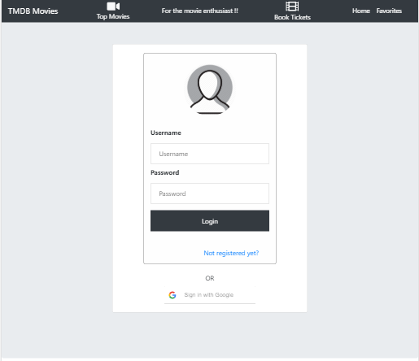
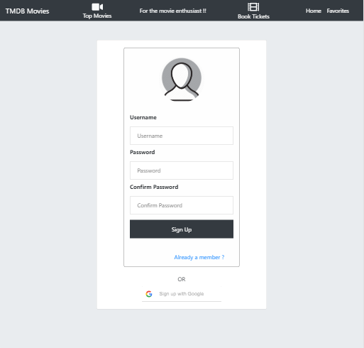
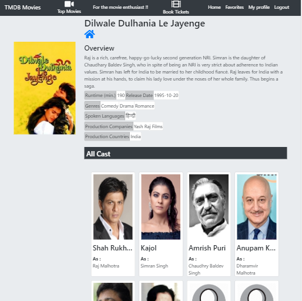
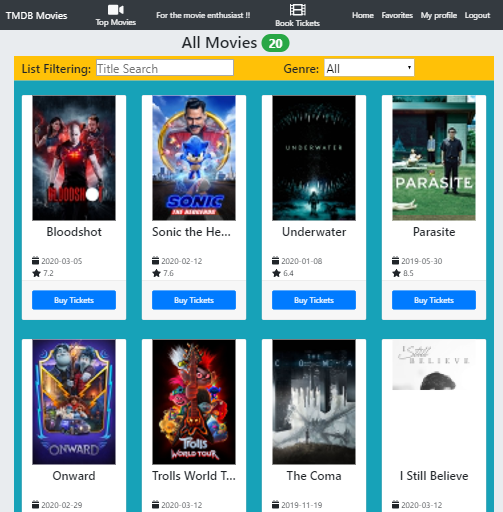
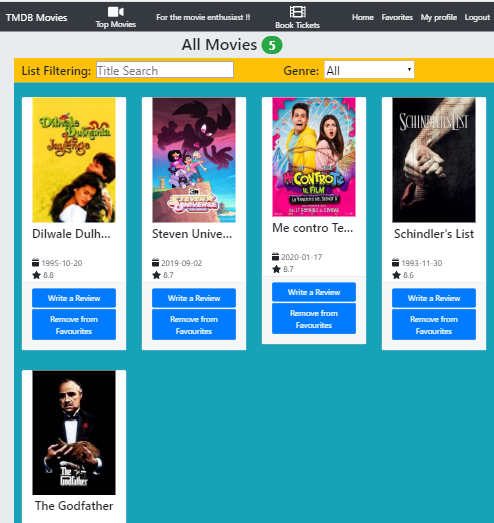
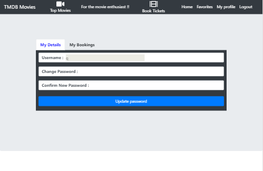
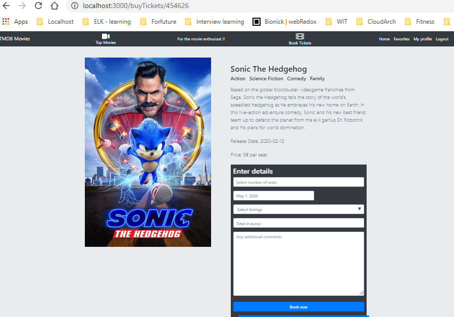

# Assignment 1 - ReactJS app.

Name: Pursharath Ahuja (20087434)

## Overview.
Additional features added
 + Homepage showing best movies of all times. 
 + Latest movies listing on click on book tickets.
 + Buy tickets details page with useForm.
 + Bookings list under my profile page.
 + Profile page with password update field
 + Add and remove favourites
 + Add reviews and listing both local and TMDB reviews
 + List of Actors on movie detail page
 + List of Crew on movie detail page
 + Sign in/ Sign Up via google (note: This feature will work on localhost only as google only allows named addresses in whitelist and live hosting uses free tier amazon ec2 instance that can only be accessed via IP address.)

## Setup requirements.

+ Install NPM (node package manager) 
+ Add code base via GIT (git clone https://github.com/pursharathahuja/moviesFullStack.git)
+ cd / frontend
+ npm install
+ Make sure to serve backend code first.
+ npm start or npm build

## Data Model Design.
### API's used:
+ /api/movies => GET request to list of best movies of all time.
+ /api/latest-movies => GET request to list of Latest movies showing in cinemas.
+ /api/movies/${id}  => GET request to get specific movie details.
+ /api/genres => GET request to get a list of genres.
+ /api/movies/${id}/reviews => GET request for specific movie reviews.
+ /api/movies/${id}/credits => GET request to for actors list for a specific movie.
+ /api/movies/${id}/credits => GET request for a list of crew members for a specific movie.
+ /api/users => POST reuest for user login.
+ /api/users/${username} => PUT request to update logged in user's details.
+ /api/users?action=register => POST request to register a user.
+ /api/users/${user}/favourites => POST request to add favourites to a user.
+ /api/users/${user}/favourites/${movie.id} => DELETE request to remove favourites.
+ /api/users/${user}/favourites => GET request to list all favourites of a specif user.
+ /api/users/${user}/bookings => GET request to list all user bookings.
+ /api/movies/${movieId}/reviews => POST request to add a review for a movie.
+ /api/users/${user}/bookTickets => POST request to create a booking for a movie.

## App Design.

### Component catalogue.
+ AllCasts Component
+ AllCrew Component
+ Buttons Component- AddReview
+ Buttons Component- AddToFavourites
+ Buttons Component- BuyTickets
+ Buttons Component- Removefavourites
+ FilterControls Component
+ HeaderMovie Component
+ HeaderMovieList Component
+ LoginForm Component
+ MovieCard Component
+ MovieDetails Component
+ MovieList Component
+ MovieReview Component
+ MovieReviews Component
+ SignUpForm Component
+ ReviewForm Component
+ SiteHeader Component
+ TemplateMovieList Component
+ TemplateMoviePage Component
### Design patterns.
### New occurrences.
+ AllCasts Component
+ AllCrew Component
+ Buttons Component- BuyTickets
+ Buttons Component- Removefavourites
+ LoginForm Component
+ SignUpForm Component

## UI Design.
+ Login Page with google sign-in

+ SignUp Page with google sign-up

+ Movies detail page with all crews and casts

+ Book Tickets Page

+ FavouritesPage

+ My profile page

+ Buy Tickets Page

## Routing.
+ /login - Shows login Screen.
+ /signup - Shows signUp screen.
+ /movies -> Homepage lists top movies of all time.
+ /movies/:movieID -> show specific movie details.
+ /tickets -> shows list of latest movies in cinemas.
+ buyTickets/:movieID -> form to buy tickets to specifc movie.
+ /movies/favorites -> shows list of all favourite movies.
+ /profile-> Shows user profile page with a bookings tab
+ reviews/form -> shows form to submit reviews.
+ reviews/:movieID -> shows movie reviews along with reviews added by user.

## Independent learning.

+ Login/SignUp via google 
+ useForm hooks for Forms
+ 3rd party tabs component used in my profile section.
